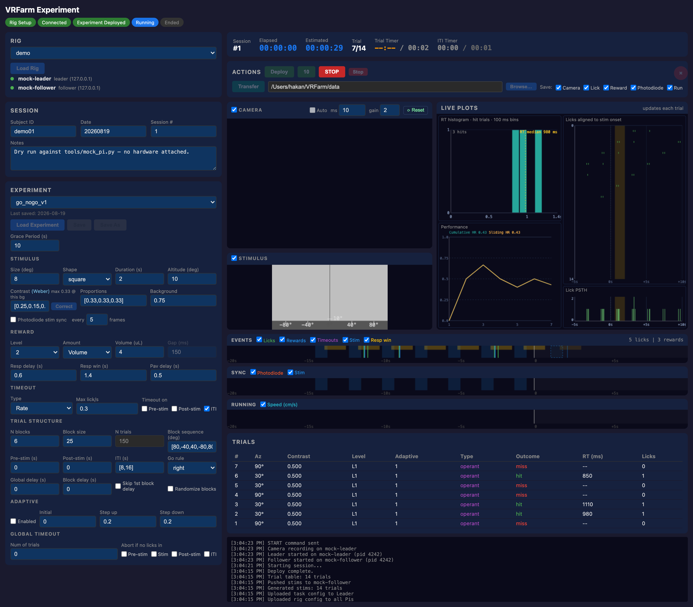

# VRFarm

A behavioural neuroscience rig for head-fixed mice: visual stimuli on a rear-projected
curved screen, capacitive lick detection, calibrated liquid reward, a running wheel,
behaviour video, and photodiode sync — all driven from a browser on the controller.

One rig is two Raspberry Pis. The **Leader** runs the trial loop and every behavioural
device; the **Follower** does nothing but render the projector. The **Controller**
(your Mac/Linux box) hosts two Flask UIs, streams live events, and stores the data.
Rigs are named after cheese.

<p align="center">
  
</p>

---

## How it fits together

```
Controller ── setup UI :4999   build and service the rig
           └─ experiment UI :5000   run sessions, watch live, pull data
                │
                │  REST :5080   deploy code, init devices, camera
                │  UDP  :5572 → START / STOP / REWARD
                │  UDP  :5571 ← trial, lick, reward, stim, sync
                ▼
        Leader Pi ──────────────────────────────────────────────┐
        engine/leader.py: ITI → pre-stim → stim → response       │ UDP :5575
        delay → response window → post-stim, writing HDF5        │ SHOW / QUIT
        lick · reward · camera · photodiode · encoder            ▼
                                                          Follower Pi
                                                    engine/follower.py: pygame
                                                    renders from a pre-built NPZ
```

Three ideas carry most of the design:

- **Devices are plug-in.** One file in `devices/` declares its I/O type, its packages,
  its tunable parameters and how it writes HDF5. Adding hardware does not touch the engine.
- **Config is split by lifetime.** Hardware facts (pins, calibration, IPs) live in
  `rigs/*.yaml`; the paradigm lives in `experiments/*.yaml`; subject and session are typed
  in at run time. Nothing machine-specific is committed.
- **Stimuli are precomputed.** The Leader builds the whole session's stimulus plan up
  front — geometry warp and luminance correction included — so the Follower only has to
  look up a trial and blit it.

---

## Quick start

Already-built rig, controller already set up:

```bash
conda activate vrfarm
python app/app.py       # experiment UI -> http://localhost:5000
```

Then: **Load Rig → Load Experiment → fill in Subject/Date/Session # → Deploy → GO**,
and **Transfer** when it ends. Walkthrough with screenshots:
[Experiment UI](docs/EXPERIMENT_UI.md).

**No hardware?** The whole stack runs on loopback:

```bash
python tools/mock_pi.py     # fake Pi + fake leader
python app/app.py           # rig = demo, then Deploy -> GO for a scripted session
```

**New machine or new rig?** Start at [CONTROLLER_SETUP.md](docs/CONTROLLER_SETUP.md),
then [INITIAL_SETUP_REFERENCE.md](docs/INITIAL_SETUP_REFERENCE.md).

---

## Documentation

| Guide | For |
|---|---|
| **[Docs index](docs/README.md)** | Everything, organised by task |
| [Controller setup](docs/CONTROLLER_SETUP.md) | New controller: network, SSH, conda, data dir |
| [Rig bring-up reference](docs/INITIAL_SETUP_REFERENCE.md) | New/reflashed Pi, envs, GPIO, projector, systemd |
| [Setup UI](docs/SETUP_UI.md) | Defining a rig, deploying code, servicing Pis |
| [Experiment UI](docs/EXPERIMENT_UI.md) | Running a session, live plots, transfer |
| [Experiment protocol](docs/EXPERIMENT_PROTOCOL.md) | Pre-session checks, task parameters, timing |
| [Calibration protocol](docs/CALIBRATION_PROTOCOL.md) | Warp map, luminance, reward valve |
| [Data format](docs/DATA_FORMAT.md) | HDF5 layout and the analysis loaders |
| [Leader wiring](docs/LEADER_WIRING.md) | Pins, 40-pin header map, GPIO rules |
| [Rig health monitor](shepherd/README.md) | shepherd: what it watches, thresholds, alerts |

---

## Repo layout

```
app/           experiment UI (Flask + SSE)          localhost:5000
setup/         rig setup UI (Flask)                 localhost:4999
engine/        leader.py (trial loop) · follower.py (renderer)   -> run on the Pis
devices/       one file per device type + the Device base class
pi_api/        REST API deployed to each Pi (port 5080) + systemd unit
shared/        config loaders, stimulus generator, HDF5 consolidation, notifications
rigs/          rig hardware configs (demo.yaml runs with no hardware)
experiments/   task/paradigm YAMLs
display_calibration/   projector geometry, warp map, luminance fitting
display_diagnostics/   bench tools for the sync square and projector colour
shepherd/      rig health watchdog that runs on a Pi (temperature, disk, CPU, encode rate)
analysis/      HDF5 loaders and analysis notebooks
tools/         mock_pi.py (hardware-free harness) · capture_ui_shots.py (doc screenshots)
docs/          documentation (docs/images generated; docs/assets is local-only)
```

## Requirements

**Controller** — Python 3.11 conda env `vrfarm`:
`flask requests scipy matplotlib numpy h5py pyyaml`

**Pis** — Debian 13 (trixie), conda env `rig` whose Python **must match the system
Python**, because the camera and GPIO bindings are apt-built and symlinked in. GPIO is
`lgpio` (no daemon; works on Pi 4 and Pi 5). Per-device packages are installed for you by
the setup UI's **Install**.

Optional: `VRFARM_SLACK_WEBHOOK` for session start/end/timeout notifications;
`VRFARM_DATA_DIR` to put session data somewhere other than `~/VRFarm/data`.
