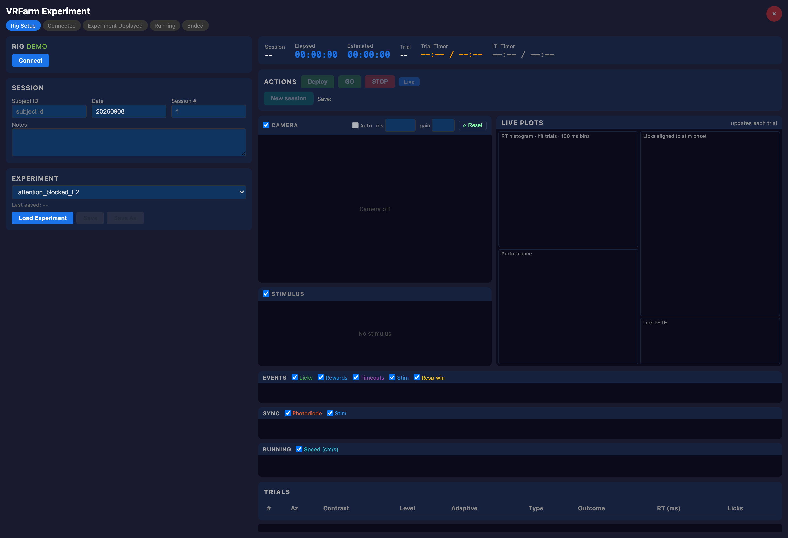
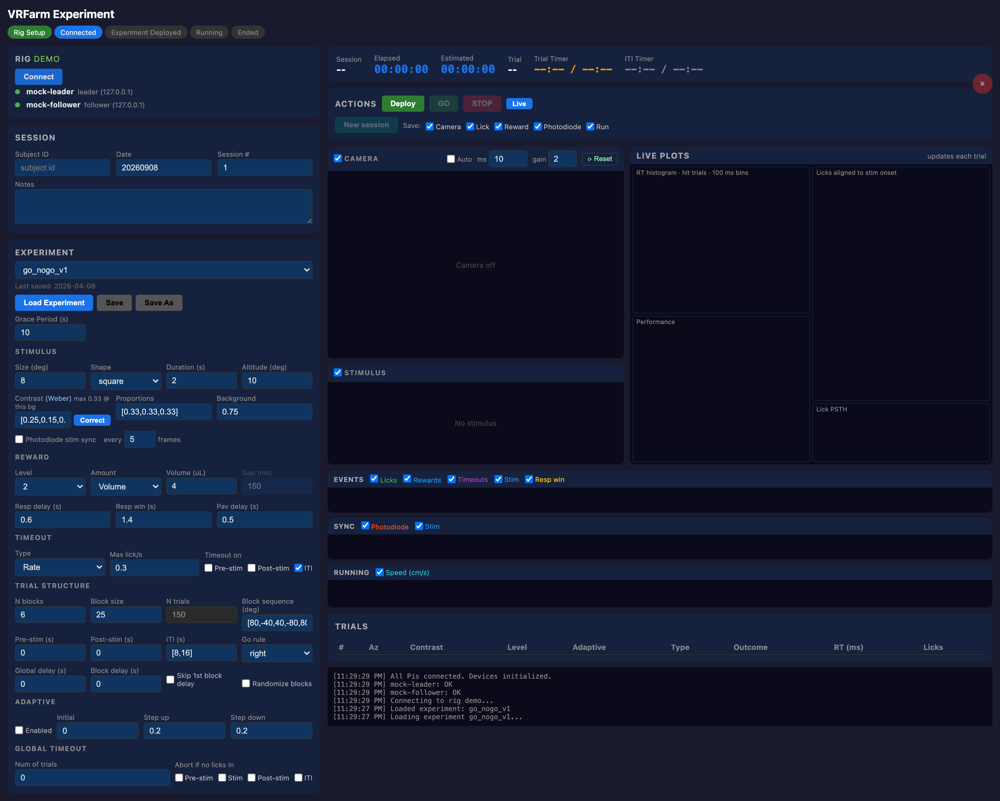
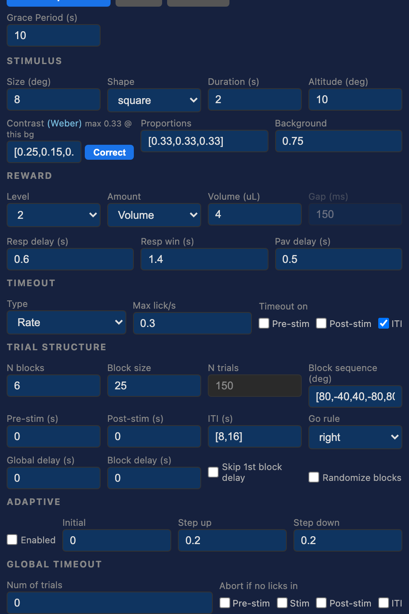
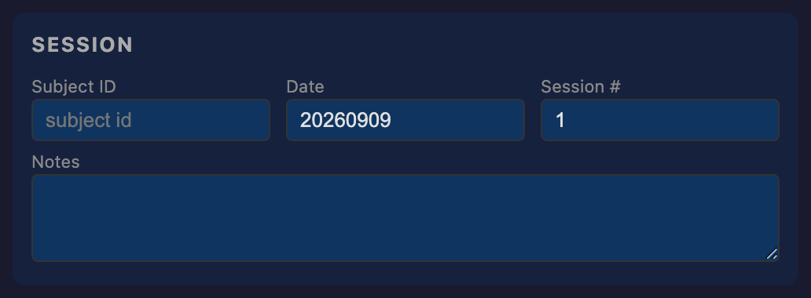
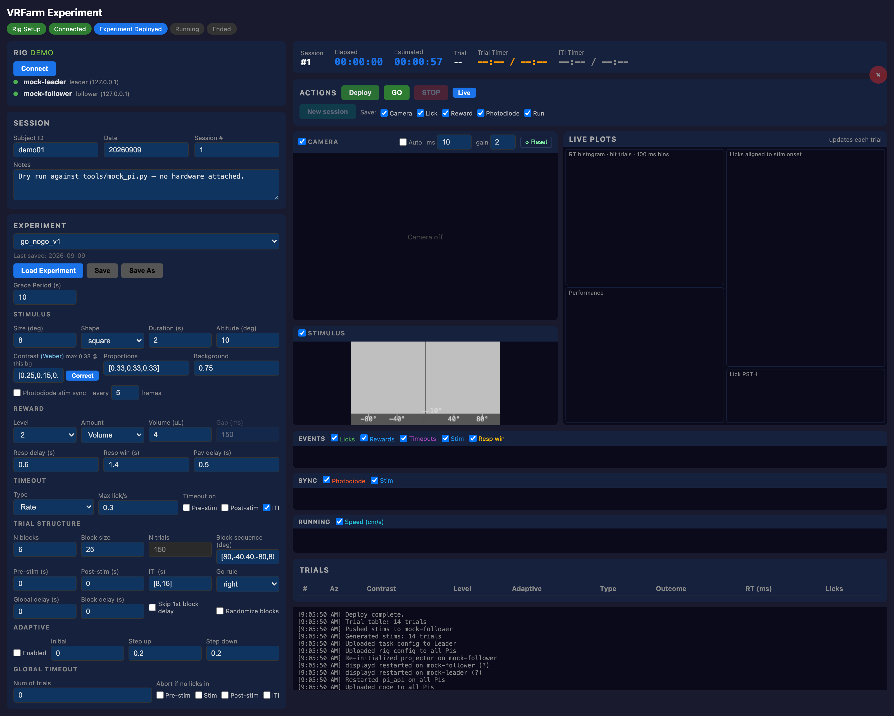
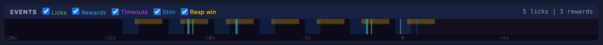
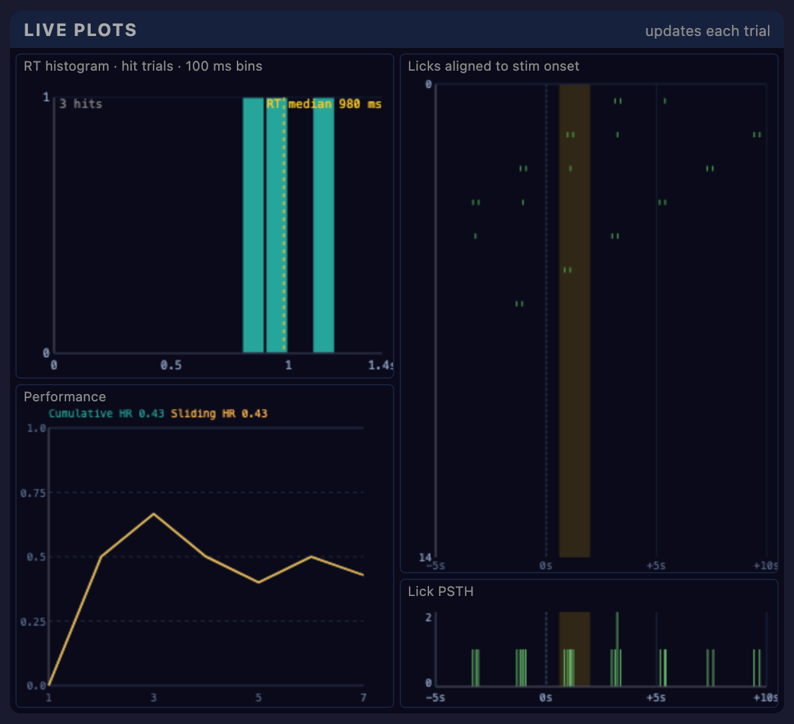
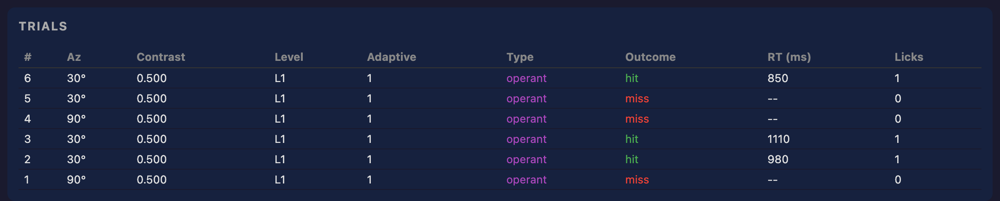
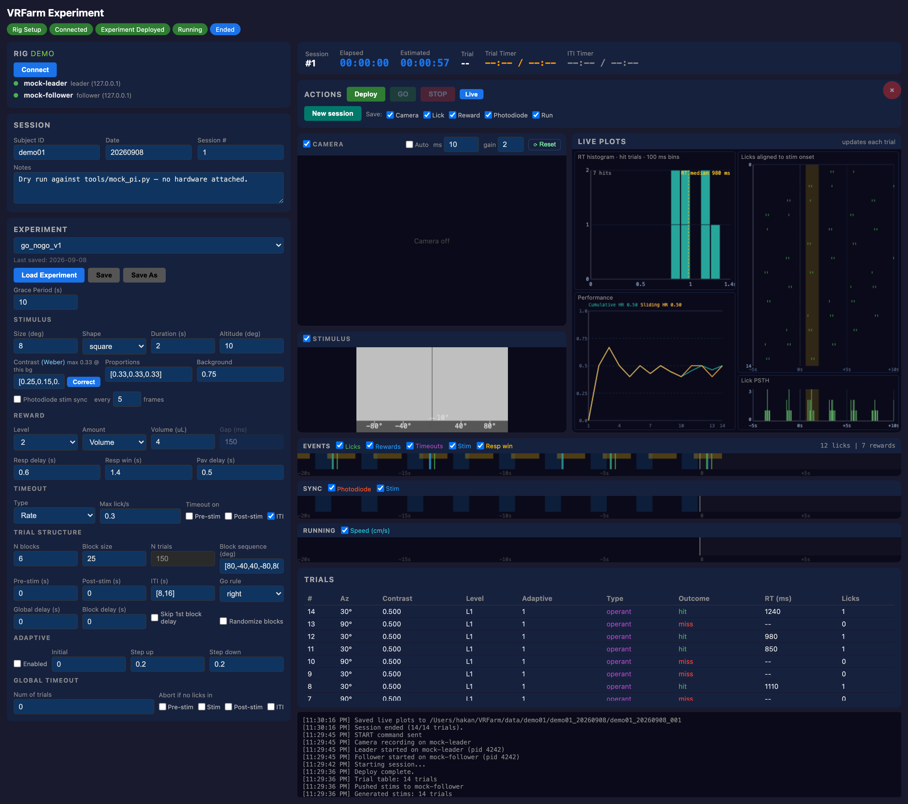

# Experiment UI — running a session

**Last updated:** 2026-08-17

This is the UI you use every experiment day: pick a subject and a task, push it to the
rig, run the session, watch the animal behave in real time, and pull the data back.
Building or servicing the rig itself happens in the [Setup UI](SETUP_UI.md).

```bash
conda activate vrfarm
python app/app.py            # http://localhost:5000
python app/app.py --port 5055 --no-browser    # if AirPlay owns 5000 (macOS)
```

For the scientific protocol — what the levels mean, what to check before an animal goes
in, what each task parameter does — read [EXPERIMENT_PROTOCOL.md](EXPERIMENT_PROTOCOL.md).
This page is about the interface.

> Screenshots are the hardware-free `demo` rig driven by `tools/mock_pi.py`.
> Regenerate with `python tools/capture_ui_shots.py`.

---

## The page at a glance


The **phase bar** under the title is the source of truth for what you can do next:

```
Rig Setup ──> Connected ──> Experiment Deployed ──> Running ──> Ended
             Load Rig        Deploy                  GO         STOP / session_end
```

| Region | What it holds |
|---|---|
| Sidebar | RIG (+ per-Pi dots) · SESSION identity · EXPERIMENT selector and the full parameter form |
| Top bar | Session #, Elapsed, Estimated remaining, Trial n/N, Trial and ITI timers |
| Actions | Deploy · GO · STOP · Live, then Transfer with its destination and per-device save checkboxes |
| Middle | Camera preview · Stimulus scene · four Live plots |
| Lower | EVENTS / SYNC / RUNNING rasters · Trials table · Log |

Panels appear only if the rig has the device: no encoder in the rig, no RUNNING strip.

On a cold start nothing is loaded yet — every action is greyed, the plots draw their axes
with placeholder text, and the phase bar sits at **Rig Setup**:



---

## Running a session

### 1. Load Rig



Pick the rig and press **Load Rig**. This is the connect step — there is no Connect
button. It contacts both Pis *and initializes every enabled device*, reporting each in the
Log. The phase only advances to **Connected** if every Pi and every device reports OK; a
failure shows a red dot and a plain-English reason ("Projector failed to initialize — is
it powered on?").

The per-Pi dots turn green as each answers:


Loading a rig **keeps** whatever experiment is already loaded — but it does drop the
deployed state, so you always need a fresh **Deploy** before GO.

### 2. Load Experiment



Pick a task from `experiments/` and press **Load Experiment**. The parameter form appears,
grouped into STIMULUS, REWARD, TIMEOUT, TRIAL STRUCTURE, ADAPTIVE and GLOBAL TIMEOUT.
Everything here is live-editable and round-trips to YAML:

- **Save** overwrites the same file; **Save As** creates a new one and selects it.
- **N trials** is computed (`N blocks × Block size`) and read-only.
- **Correct** clamps contrast to what the display can reach at the current background,
  and is the one control that explicitly invalidates a Deploy.
- Level `2.5` forces Adaptive on and locks the checkbox; Amount `Count` swaps the value
  field to a pulse count and enables **Gap (ms)**.

This step needs no rig at all — you can open the UI on a laptop and read or edit any task.

> **Saving strips comments from the task YAML.** Save, Save As and Deploy (which saves
> first) all rewrite the file through the YAML dumper: values survive, but `#` comments are
> deleted and inline lists like `iti: [8, 16]` are reflowed to block style. Keep any
> explanation you care about outside the task file, or expect to lose it the first time
> that task is deployed.

### 3. Fill in the session



**Subject ID**, **Date** (pre-filled), **Session #** and free-text **Notes**. These form
`session_id = <subject>_<YYYYMMDD>_<NNN>`, which names the data folder. Deploy refuses to
run with any of the first three blank and focuses the offending field.

### 4. Deploy



**Deploy** saves the task YAML, then uploads code and configs to both Pis, restarts
`pi_api`, re-initializes the projector, generates the stimulus plan on the Leader, pushes
the NPZ to the Follower and downloads the trial table. Each step appears in the Log.

On success the **Estimated** clock and **Session #** appear and the Stimulus canvas
initializes with the correct rulers.

Editing any task parameter after a Deploy drops the phase back to **Connected**: GO greys
out, Deploy re-arms, and the Log says *"Parameter changed after Deploy — re-Deploy before
GO."* This is deliberate — the Pis still hold the previously deployed YAML and the
pre-generated stimulus plan, so running without a re-Deploy would use the old values.

### 5. GO

Runs the session. The GO button label becomes the grace-period countdown until the first
trial starts. Live mode starts automatically, so the rasters and plots begin filling.

Before pressing GO, decide what gets saved: the **Save:** checkboxes next to Transfer are
read once, at GO. Unchecking **Camera** still livestreams but writes no video file;
unchecking a behavioural device skips its detailed HDF5 datasets while keeping per-trial
outcomes.

### 6. Monitor



The **EVENTS** raster is a sliding 30-second window with a "now" play-head: green ticks
are licks, blue are rewards, purple are timeout restarts, the blue block is the stimulus
and the amber block is the response window. Dashed markers ahead of the play-head are
*predictions* of the next stimulus and Pavlovian reward; they solidify when the real event
lands. The checkboxes filter what is drawn.

**SYNC** shows photodiode pulses against stimulus windows — the fastest way to see that
optical sync is alive. **RUNNING** shows wheel speed.



The four **Live plots** update once per trial: the RT histogram over hit trials with its
median; Performance carrying cumulative and sliding hit rate (plus false-alarm rate and
d′ when the task has no-go trials); the lick raster aligned to stimulus onset, filling
top-down over the full planned trial count; and the pooled lick PSTH.



The **Trials** table adds a row per completed trial, newest first — hit in green, miss in
red, operant purple, Pavlovian orange.

### 6b. Health alerts

If the Leader is running [shepherd](../shepherd/README.md) (the **Monitor** toggle in the
setup UI), rig-health alerts arrive in the Log prefixed with 🐑 — **orange** for a warning,
**red** for critical, plain for a recovery:

```
🐑 cheddar: SoC temperature 72 °C — throttling
🐑 cheddar: camera encode 28 fps — dropping frames
```

These matter mid-session because the Pi 5 software-encodes H.264 with no fan: when it
throttles, the encoder drops frames and corrupts frame timing, and nothing in the preview
or the live plots shows it. An alert here is a reason to stop and check before the session
is wasted.

### 7. End and transfer



A session ends by itself after the planned trials, or aborts on the global timeout if the
animal is dry for too many consecutive trials. **STOP** ends it early. Either way the four
live plots are saved as PNGs into the session folder and the phase becomes **Ended**.

**Transfer** then asks the Leader to consolidate everything into one self-contained
`<session_id>.h5`, downloads it (plus `video.h264`), and registers the session in the
subject index. Files land at:

```
<dest>/<subject>/<subject>_<date>/<session_id>/
├── <session_id>.h5     # trials, stimulus plan, per-device data, camera timestamps, metadata
└── video.h264          # only if Camera was checked at GO
```

The destination defaults to `$VRFARM_DATA_DIR` (else `~/VRFarm/data`); the field next to
the button overrides it for one transfer. Layout details: [DATA_FORMAT.md](DATA_FORMAT.md).

For the next session, bump **Session #** and **Deploy** again — GO requires a fresh
deploy every time.

---

## Button enablement

Almost every "why is this greyed out" answer is here.

| Control | Enabled when |
|---|---|
| Load Rig / Load Experiment | Not busy. Load Experiment needs no rig |
| Save / Save As / Correct | A task is loaded |
| **Deploy** | Rig **and** task loaded, and phase is at least Connected |
| **GO** | Phase is exactly **Deployed** — one GO per Deploy |
| **STOP** | Phase is Running |
| **Live** | A rig is loaded |
| **Transfer** | Phase is Ended |
| Camera exposure/gain | A rig is loaded and no session is running (locked during recording) |
| **×** Quit | Not running |

---

## Camera controls

The `Auto` / `ms` / `gain` fields push straight to the Pi and are **runtime-only** — they
are never written to the rig YAML, so they reset on the next Load Rig. They are locked
during a recording (the server returns 409). **⟳ Reset** rebinds the sensor driver on the
Pi and restarts the preview; use it if the feed freezes.

A broken preview image is usually the relay reconnecting after a `pi_api` restart — it
retries on its own. If it persists, **⟳ Reset**, or **Reinit** the camera in the setup UI.

---

## Dry-running without hardware

`tools/mock_pi.py` fakes both the REST API and the Leader's UDP event stream, so it can
drive a whole scripted session — trials, licks, rewards, plots, `session_end`.

```bash
python tools/mock_pi.py       # fake pi_api :5080 + fake leader UDP
python app/app.py             # rig = demo -> Load Rig -> Load Experiment -> Deploy -> GO
```

Useful knobs: `MOCK_N` (trials), `MOCK_ITI`, `MOCK_TRIAL_S`, and `MOCK_END=timeout` to
exercise the global-timeout abort path. The camera stays blank — the mock serves no MJPEG.

---

## Troubleshooting

| Symptom | Cause / fix |
|---|---|
| **Deploy** greyed | Needs a rig **and** a task loaded, and phase at least Connected. If a Pi is red, Load Rig did not reach Connected |
| **GO** greyed | You are not in the Deployed phase. After a session, and after any Load Rig, you must re-Deploy |
| Deploy refuses with an alert | Subject ID / Date / Session # is blank |
| A Pi is red on Load Rig | `ping` it, then `curl http://<ip>:5080/api/status`, then `sudo systemctl status vrfarm` |
| Phase dropped to Connected on its own | You edited a task parameter, which invalidates the deploy. Press **Deploy** again |
| Rasters empty during a run | Press **Live**; if still empty, inbound UDP 5571 is blocked on the controller ([CONTROLLER_SETUP.md §1](CONTROLLER_SETUP.md#1-network--static-ip-on-the-wired-nic)) |
| ⚠️ *CAMERA NOT RECORDING* in the log | The session runs without video. Check the SSD mount and `data.video_dir` |
| 🐑 alerts in the log | shepherd health warnings from the Leader — temperature, disk, CPU or encode rate. See [shepherd/README.md](../shepherd/README.md) |
| Transfer downloads nothing | Check the Leader still holds the session folder, and that Save checkboxes were set at GO |

---

**Next:** [Experiment protocol](EXPERIMENT_PROTOCOL.md) · [Data format](DATA_FORMAT.md) · [Docs index](README.md)
