# Setup UI — building and maintaining a rig

**Last updated:** 2026-08-17

The setup UI is where a rig is *defined and serviced*: which Pis exist, which devices
hang off them, what pins and calibrations they use, and how code gets onto the hardware.
You use it when building a rig, after changing wiring, after editing code, and for
projector calibration. You do **not** use it to run a session — that is the
[Experiment UI](EXPERIMENT_UI.md).

```bash
conda activate vrfarm
python setup/app.py          # http://localhost:4999 (opens a browser tab)
```

It writes `rigs/<name>.yaml` and `display_calibration/rig_geometry*.yaml`, and it is the
only part of VRFarm that uses SSH — Install, Reboot, Shutdown, warp generation and
geometry calibration all shell out over `ssh`/`scp`. See
[CONTROLLER_SETUP.md §2](CONTROLLER_SETUP.md#2-passwordless-ssh-to-the-pis) if those
fail with a password prompt.

> Every screenshot below is the hardware-free `demo` rig (both Pis on `127.0.0.1`,
> answered by `tools/mock_pi.py`). Regenerate them all with
> `python tools/capture_ui_shots.py`.

---

## The page at a glance

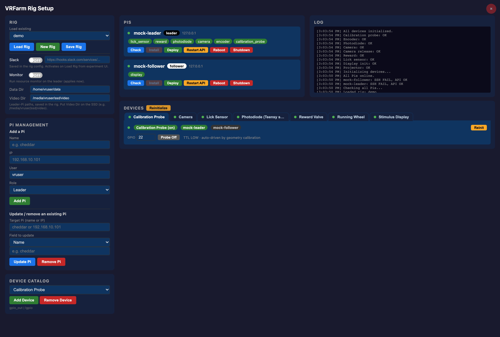

Three columns, and the layout maps onto the workflow:

| Region | Card | What it is for |
|---|---|---|
| Left | **Rig** | Load / create / save a rig file; Slack; the Leader's data + video paths |
| Left | **Pi Management** | Add, edit and remove Pis in the loaded rig |
| Left | **Device Catalog** | Add or remove device *types* from the rig |
| Middle | **Pis** | One card per Pi: status dot, assigned devices, and the six service actions |
| Middle | **Devices** | A tab per device with its live controls — the working area |
| Right | **Log** | Reverse-chronological; every action reports here. Read it when something fails |

The red **×** at top right stops the Flask server.

---

## Order of operations

The UI enforces a strict sequence through button enablement. Fighting it is the most
common source of "why is everything greyed out".

```
Load Rig ──> Check (per Pi, automatic) ──> Initialize ──> device controls unlock
   │                                           ▲
   └─ Install (fresh Pi, once) ── Deploy ──────┘   (both revert devices to uninitialized)
```

1. **Nothing works before a rig is loaded.** Add Pi, Add Device and the update controls
   all bail with *"Load or create a rig first"*. On a cold start the Pis and Devices areas
   are empty and **Initialize** is greyed:

   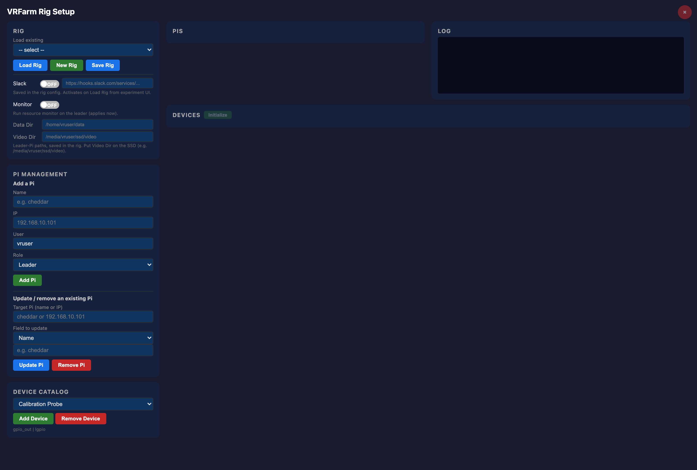
2. **Load Rig auto-checks every Pi.** There is no Connect button; per-Pi **Check** is the
   manual re-run.
3. **Initialize is the master gate.** It stays disabled until *every* Pi answers on its
   REST API. Until it succeeds, every device panel is greyed with *"Waiting for Pi
   check..."* or *"Press Initialize to enable device controls."*
4. **Deploy and Restart API un-initialize everything.** Both restart `pi_api` on the Pi,
   which drops the device handles — the dots go grey and you press **Initialize** again.
   This is expected, not a failure.

Straight after Load Rig the Pis are green and **Initialize** has gone live, but the device
area is still empty — that is the moment to press it:


---

## Rig card

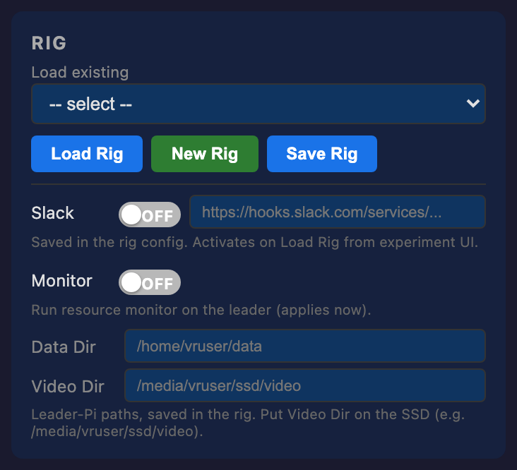

| Control | Effect |
|---|---|
| **Load Rig** | Reads `rigs/<name>.yaml`, then automatically checks the warp map and every Pi |
| **New Rig** | Prompts for a name and **immediately writes** `rigs/<name>.yaml` — a same-named rig is overwritten without warning |
| **Save Rig** | Writes the rig YAML **and** the currently loaded geometry file in one click |
| Slack + webhook | Stored in the rig; the *experiment* UI activates it on its own Load Rig |
| **Monitor** toggle | Starts/stops [shepherd](../shepherd/README.md), the health watchdog on the Leader. Applies immediately, and is re-applied on Install |
| Data Dir / Video Dir | **Leader-side** paths. Point Video Dir at the SSD — the Leader's card cannot hold video |

`Save Rig` is the single persistence point. Pi edits, device assignments, pin numbers,
calibration tables and geometry parameters all live in memory until you press it.

---

## Pi Management

Add a Pi with **Name / IP / User / Role**; `role` must be `leader` or `follower`. To edit
one, pick it under *Target Pi*, choose the field, type the new value, **Update Pi**. Name
and IP collisions are rejected, and changing an IP migrates that Pi's status internally.

All three buttons are client-side only — **Save Rig** persists them.

## Device Catalog

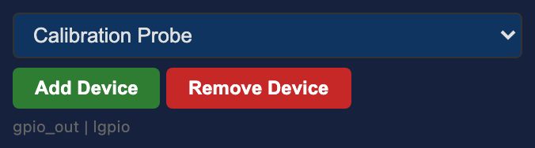

The dropdown lists every registered device class, with `✓` on those already in the rig.
The grey line underneath shows its I/O type and required packages (e.g.
`gpio_out | lgpio`) — that is what **Install** will put on the Pi.

Adding a device puts it in the rig but **not on a Pi**. You must then open its tab and
click the Pi-name chip to assign it. An unassigned device can never initialize.

---

## Per-Pi actions

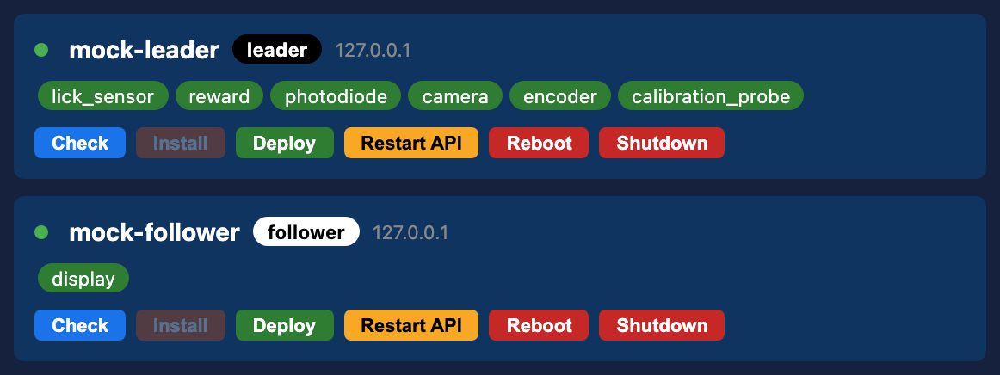

The dot is green when the Pi's REST API answers. The chips are its assigned devices.

| Button | What it does | When to use it | Risk |
|---|---|---|---|
| **Check** | SSH `echo ok` + `GET /api/status` | Any time; ~5 s | none |
| **Install** | Full first-time provisioning: conda `rig` env pinned to the system Python, apt packages, I²C enable, binding symlinks, pip, all code, `config.txt`/`xorg.conf`, systemd unit | **Once**, on a fresh Pi | **Minutes; rewrites boot config.** Needs passwordless sudo. Reboot the follower afterwards |
| **Deploy** | Uploads current code, restarts `pi_api` | After **every** code change | Drops initialized devices |
| **Restart API** | Asks `pi_api` to self-kill; systemd respawns it | When the API is wedged | Drops initialized devices |
| **Reboot** | `sudo reboot` | After Install on the follower | Pi offline ~40 s |
| **Shutdown** | `sudo shutdown -h now` | End of life | **Needs physical access to power back on** |

**Install** is disabled when SSH fails; the other five are disabled when the API is down.
A Pi showing *"SSH FAIL, API OK"* still works for everything except Install.

---

## Initialize

Press **Initialize** (in the Devices header) once all Pis are green. It initializes each
enabled device on its assigned Pi in a fixed order — display first, then lick sensor,
reward, camera, photodiode, encoder, calibration probe — and reports each in the Log.


Afterwards the button becomes yellow **Reinitialize**, each tab carries a status dot
(green = up, red = failed, grey = untried), and every panel's controls unlock. A device
that is switched off shows a dimmed label. Per-card **Reinit** re-runs a single device
without touching the others — the fastest way to recover one failed sensor.

---

## Device cards

Each card edits **rig-config** values — pins, addresses, calibration — not task
parameters. Task parameters live in `experiments/*.yaml` and are edited in the
experiment UI.

### Camera

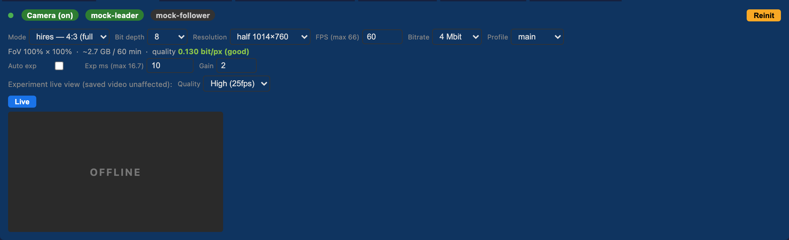

Stream settings are locked while streaming — press **Stop** to change them. `Exp ms` is
clamped to `1000/fps`, and the frame rate is clamped to the sensor's ceiling so you cannot
over-request one and silently under-deliver.

| Control | What it sets |
|---|---|
| **Mode** | Sensor readout mode — the raw window the sensor scans (e.g. `2028×1520`). Determines the field of view and the achievable frame rate |
| **Resolution** | The encoded output size, downscaled from the sensor mode |
| **FPS** / **Bit depth** | Frame rate and sensor bit depth. Higher bit depth costs bandwidth and caps the frame rate |
| **Bitrate** / **Profile** | H.264 target bitrate and profile. The Pi 5 has no hardware encoder, so these directly drive CPU load — see [shepherd](../shepherd/README.md) |
| **Auto exp** / **Exp ms** / **Gain** | Exposure. Manual fields grey out under Auto |
| **Quality** (*Experiment live view*) | Preview only — never affects the recorded file |

The grey line under the controls is derived live from those settings — field of view
retained, projected file size per hour, and encode quality in bits/pixel. Use it to trade
resolution against disk before a long session rather than discovering the cost afterwards.

**Live** is disabled until the camera has initialized; the grey `OFFLINE` box is the
placeholder before a stream starts.

### Stimulus Display

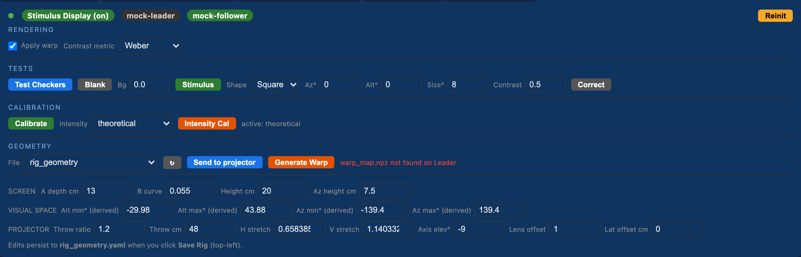

The densest panel in the app, in four blocks:

- **RENDERING** — whether the warp map is applied, and which contrast metric the rig
  authors in (Weber / Michelson / Normalized). Changing the metric reinterprets every
  existing task YAML, so set it once per rig.
- **TESTS** — **Test Checkers** for focus and geometry, **Blank** to set the background
  to a plain 0–1 gray, **Stimulus** to place a patch at an azimuth/altitude. **Correct**
  clamps the typed contrast to what the display can actually reach at that background.
- **CALIBRATION** — **Calibrate** opens the landmark tool (below); **Intensity** selects
  the luminance-correction mode.
- **GEOMETRY** — the screen/projector model. The four **VISUAL SPACE** fields are
  derived, not editable: altitudes are computed in the browser, azimuths are ray-traced
  by the server as you type. Edits here are written when you press **Save Rig**.

### Reward Valve

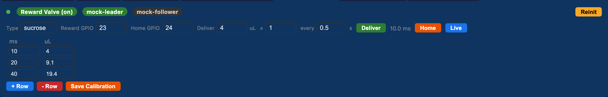

Set the GPIO pins, then build the **ms → µL** calibration table with **+ Row**, and press
**Save Calibration**. **Deliver** interpolates the pulse width for the requested volume
and fires it *n* times at the given interval — that is how you prime the line and verify
the table. The **Home** button only appears if a home pin is configured. Full procedure:
[CALIBRATION_PROTOCOL.md](CALIBRATION_PROTOCOL.md).

### Lick Sensor

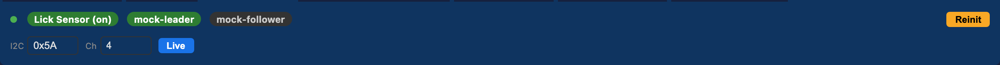

Set the I²C address (`0x5A`) and the electrode channel, press **Live**, and touch the
spout — ticks appear on the 30-second raster and *Last lick* updates. If nothing
registers, confirm the electrode number matches the wiring before suspecting the sensor.

### Photodiode

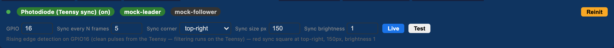

The photodiode timestamps sync pulses from the Teensy. The `Sync ...` fields are authored
here but consumed by the **display** — they control the red patch the projector draws.
**Live** shows a triggered scope (−2 ms to +14 ms); **Test** additionally tells the
display Pi to start flashing the patch, so you can confirm the whole optical path in one
click. Filtering now lives on the Teensy, so there are no debounce sliders.

### Running Wheel

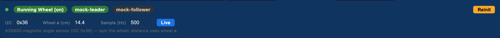

I²C magnetic encoder. Set the wheel diameter (it scales cm/s and distance) and the sample
rate, then **Live** and spin the wheel.

### Calibration Probe

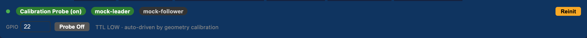

A single GPIO that **latches** high or low — a TTL marker for aligning an external
recording to a calibration session. It is driven automatically by the geometry
calibration; the button is for testing.

---

## Geometry calibration and the warp map

The rig is **rear-projected** onto a curved screen, so a stimulus at a requested azimuth
only lands correctly once the geometry is registered and a warp map is built.

1. In **CALIBRATION**, press **Calibrate**. The follower's X server restarts, the probe
   latches HIGH, and a popup opens the landmark tool served from the Pi at port `5091`.
2. Register the landmarks there and press its Save — the result posts back and is written
   as a timestamped `rig_geometry_<date>.yaml` alongside the canonical file.
3. Press **↻** to refresh the **File** list, pick the new geometry.
4. Press **Generate Warp**. The controller computes `warp_map.npz` locally, copies it to
   every Pi and asks each to reload it. The status line flips to a green
   *"warp_map.npz found on Leader"*.

**Send to projector** pushes a geometry file to the display Pi without regenerating the
warp — useful when only the model changed. Parameter meanings are in
[display_calibration/geometry_params.md](../display_calibration/geometry_params.md);
the full procedure is in [CALIBRATION_PROTOCOL.md](CALIBRATION_PROTOCOL.md).

## Intensity calibration

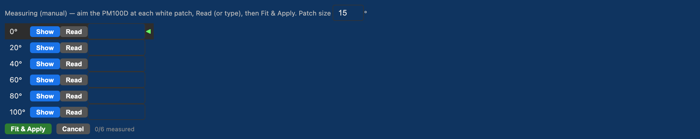

The projector is brighter at the centre than at the edges. The correction measures
luminance at six azimuths and attenuates *down* to the dimmest one, so a stimulus has the
same luminance wherever it appears.

Choose `auto` or `manual` under **Intensity**, press **Intensity Cal**, then for each
azimuth press **Show** (manual) and **Read** to take a Thorlabs PM100D reading — or type
the value if no meter is attached. With at least two readings, **Fit & Apply** writes the
calibration and rebuilds and redeploys the warp. `theoretical` uses the modelled falloff;
`none` disables correction entirely.

---

## Running without a rig

`rigs/demo.yaml` plus `tools/mock_pi.py` gives a fully interactive UI with no hardware —
useful for demos, for finding your way around, and for regenerating these screenshots.
Both of its Pis are `127.0.0.1`, so a mis-click cannot reach the real rig.

```bash
python tools/mock_pi.py     # fake pi_api on :5080
python setup/app.py         # then: Load Rig -> demo -> Initialize
```

What does not work under the mock: Install / Reboot / Shutdown (real SSH), Generate Warp
and Intensity Cal (they compute locally, then fail at the copy step), the camera preview
(the mock serves no MJPEG), and the warp status, which always reads *not found*.

---

## Troubleshooting

| Symptom | Cause / fix |
|---|---|
| Everything greyed out | No rig loaded — **Load Rig** first |
| **Initialize** stays disabled | At least one Pi is not answering on port 5080. Press **Check**; then `sudo systemctl status vrfarm` on the Pi |
| Device card says *"Waiting for Pi check..."* | Same cause — the panel unlocks only after a successful Initialize |
| Devices go grey by themselves | You pressed **Deploy** or **Restart API**. Press **Initialize** again |
| *"SSH FAIL, API OK"* | The key or `known_hosts` entry is missing. Only **Install** needs SSH — see [CONTROLLER_SETUP.md §2](CONTROLLER_SETUP.md#2-passwordless-ssh-to-the-pis) |
| Install fails on a `sudo` step | `vruser` needs passwordless sudo — [INITIAL_SETUP_REFERENCE.md](INITIAL_SETUP_REFERENCE.md#new-pi-first-boot-headless-bring-up) step 5 |
| A device won't initialize | Confirm it is assigned to a Pi (click the Pi chip in its card), then check pins and packages |
| Camera preview is a broken image | Expected under the mock. On the real rig, press **Stop** then **Live**, or **Reinit** the camera |
| Warp status red on a working rig | `/api/check_warp` looks only on the Pi with `role: leader` |
| Edits vanished | You did not press **Save Rig** |

---

**Next:** [Experiment UI](EXPERIMENT_UI.md) · [Calibration protocol](CALIBRATION_PROTOCOL.md) · [Docs index](README.md)
